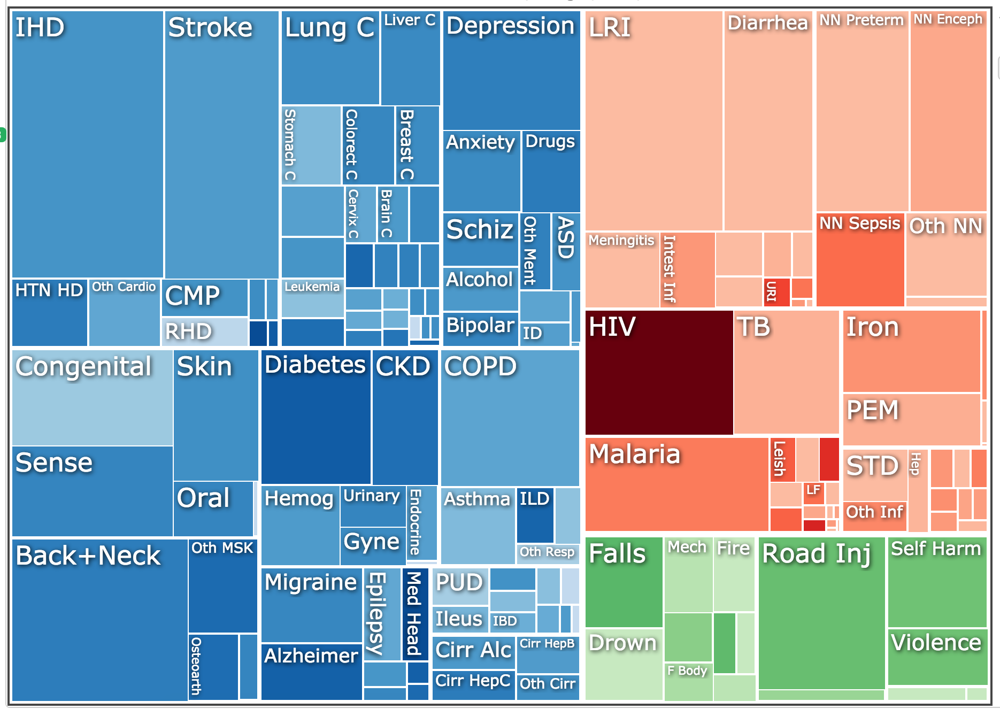

# Module 9: D3 Layout Functions

## Overview
In this module, we'll introduce [D3 Layout Functions](https://github.com/mbostock/d3/wiki/Layouts) that facilitate manipulating your data structure to express hierarchical relationships. We'll use the example of a [Treemap](http://www.cs.umd.edu/hcil/treemap-history/) to examine the value of the layout functions.
<!-- START doctoc generated TOC please keep comment here to allow auto update -->
<!-- DON'T EDIT THIS SECTION, INSTEAD RE-RUN doctoc TO UPDATE -->
**Contents**

- [Resources](#resources)
- [Data Preparation](#data-preparation)
  - [Data Structure](#data-structure)
  - [Nesting Data](#nesting-data)
- [Treemaps](#treemaps)

<!-- END doctoc generated TOC please keep comment here to allow auto update -->

## Resources
Here are a few resources to help you better understand and use scales.

- [D3 Layouts](https://github.com/mbostock/d3/wiki/Layouts) _(d3 wiki)_
- [Nest Method](https://github.com/mbostock/d3/wiki/Arrays#nest) _(d3 wiki)_
- [Treemap Layout](https://github.com/mbostock/d3/wiki/Treemap-Layout) _(d3 wiki)_
- [Treemap Example](https://bl.ocks.org/mbostock/4063582) _(bl.ocks)_
- [Health Burden Example](http://vizhub.healthdata.org/gbd-compare/) _Institute for Health Metrics and Evaluation_

## Data Preparation
While hierarchical layouts in D3 _look_ quite impressive, it's important to remember that they follow the same process (the data-join) to achieve the same end (elements on the DOM) as any other chart type. The true challenge involved is computing the visual attributes (`width`, `height`, `x`, `y`, etc.) that drive the intended layout. Luckily, D3 provides a variety of tools that will help you calculate the visual attributes based on your dataset. Because these methods operate on a nested data structure, they require you to format your data in a particular way in order to use them.

### Data Structure
D3 layouts that express hierarchical data presume that your data is appropriately structured. For example, in the data used in [this example](https://bl.ocks.org/mbostock/4063582), the following structure is used:


The `.json` object is in a fairly standard structure. Note, each **object** has a **children array** which stores child nodes. At any **leaf node** the children have a value that you want to visualize (in this case, `size`). While this data structure may be common in web oriented data storage platforms or `NoSQL` databases, it is quite distinct from how the data would be stored in a relational or tabular (i.e., `.csv`) format. Luckily, D3 provides us with methods for constructing a data tree from arrays of objects (the expected format for your relational data).

### Nesting Data
Let's assume that you data isn't stored in the necessary `.json` object, but instead is in a 2D table such as the following:


This data has a natural hierarchy in which each **country** has a parent **region**. The `d3.nest` method will allow us to construct a tree using the following syntax:

```javascript
// Array of objects, in the format returned by `d3.csv`
var data = [
  {name:'Allen', major:'Informatics', gpa:4.0},
  {name:'Beth', major:'Informatics', gpa:3.7},
  {name:'Ruben', major:'Informatics', gpa:3.8},
  {name:'Stephan', major:'Math', gpa:3.2},
  {name:'Alice', major:'Math', gpa:3.1},
];

// Construct a nesting function that will use each element's `major` property to group the datad3.nest() // function that returns a function...
var nest = d3.nest()
             .key(function(d){return d.major;});

// Pass your (tabular) data to the nest function to create your nested array
var nestedData = nest.entries(data);
```
The above section allows you to specify a **function** (`nest`) whose `entries` method will transform a tabular dataset into a nested data-object. The `key` value allows you to specify the value of each object that indicates the element's parent. The section above results in the following `nestedData` object:


## Treemaps
Treemaps allow you express data values for hierarchical data in a rectangular layout such as this [example](http://vizhub.healthdata.org/gbd-compare/) categorizing global disease burden into communicable diseases (red), non-communicable diseases (blue), and injuries (green).



Treemaps can be built either with `div` or `rect` elements, each of which has it's own advantages. The example provided here will use `div` elements, primarily because they enable simple text labeling, withouth having to worry about appending `text` elements (you can just set the `text` attribute of a `div`). As noted above, the challenge involved with building hierarchical layouts is computing the desired position of each element base on your data. To compute element positions, you'll  use the `d3.layout.treemap` method. Note, this method will take care of all of the scaling necessary, so you only need to specify your desired `width` and `height` for your layout:

```javascript
// Construct a treemap function that will retrieve values from your nested data
var treemap = d3.layout.treemap() // function that returns a function!
    .size([500, 500]) // set size: scaling will be done internally
    .sticky(true) // If data changes, keep elements in the same position
    .value(function(d) {return d.gpa;}) // Assert value to be used to
    .children(function(d){return d.values;}); // Determine how the function will find the children of each node
```
This function is what you will use to **calculate** the desired positions of each visual element -- it **_will not_** build you a treemap. You'll need to perform a data-join and append elements to the screen as you would in any other context. There are a few important things to note in the above function:

> Sticky: This method is important if you plan on transitioning the position of each element (`div`, or `rect`) in your treemamp. If you specify `true`, the layout algorithm will enforce a constraint that keeps elements in the same relative position if the data changes. If you don't specify `true`, each the elements will rearrange into the optimal layout (will will likely change, and be quite confusing).

> Value: The `value` method is an accessor function that allows you to specify the attribute of each piece of data that you want to visually encode as the size of the element.

> Children: The `children` method is another accessor function that allows you to specify the attribute of each piece of data that indicates how the `children` are stored. In the example above, the `nest` function will store the children in a property `values`, so that must be indicated to our `treemap` function.

In order to perform your data-join, you'll need to pass the `.data` function an **array of object**, one for each visual element you want to create. The `.nodes` method of the `treemap` object we just created will return an array of objects for each element in the tree (including parent elements). This method expects an **object** that it can traverse with specified keys for accessing the **children** of each object.

```javascript
// Retrieve the individual nodes from the tree
var treemapData = treemap.nodes({values:nestedData})
```

It's important to remember that this method will return an object for **all items in your tree**, including parent nodes. The method calculates attributes for positiong each element, and also tracks the `depth` of each value:


At this point, the necessary values have been calculated, and you can proceed with the data-join to create your visualization. To practice building a treemap, see [exercise-1](exercise-1).
